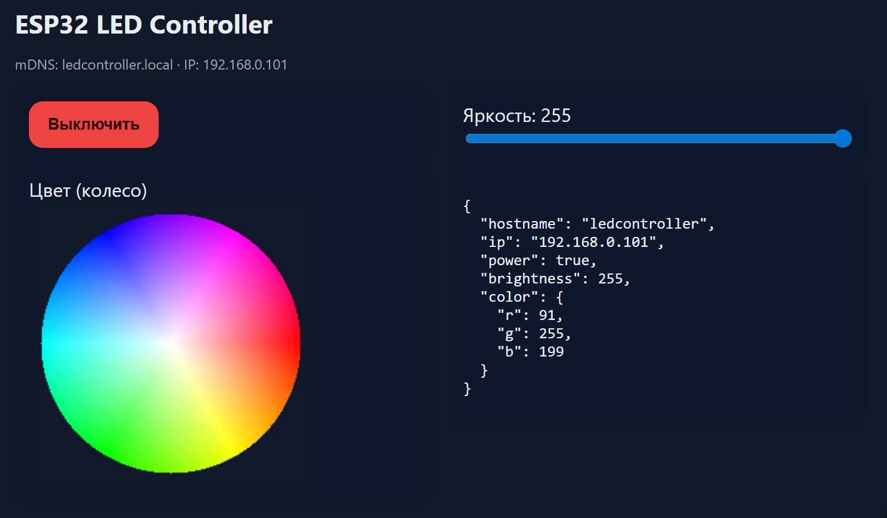
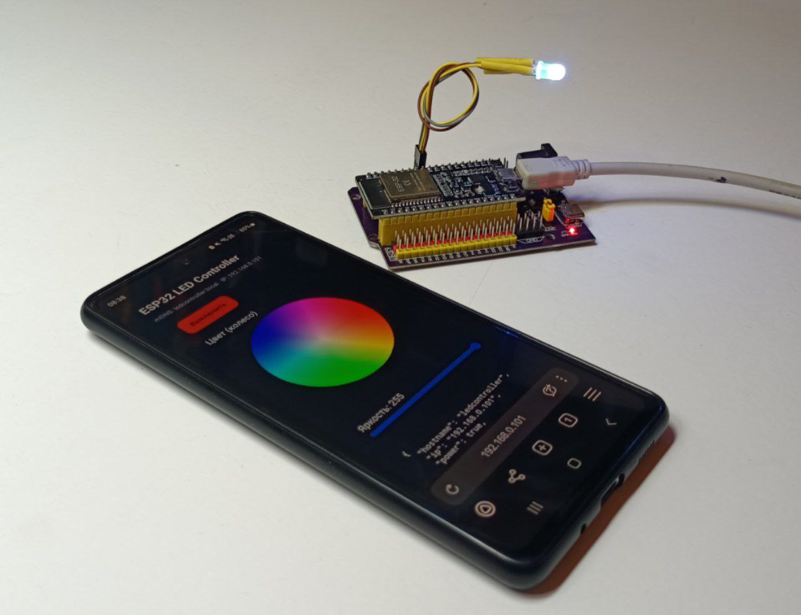
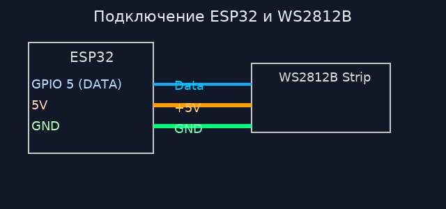
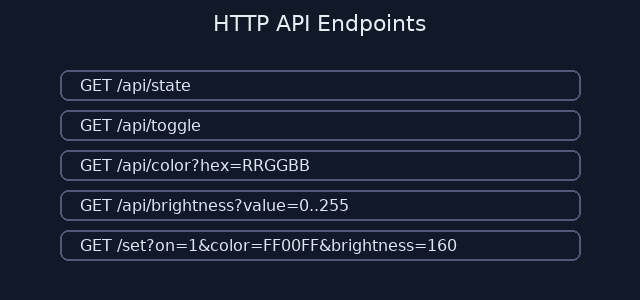
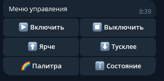
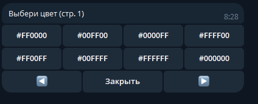
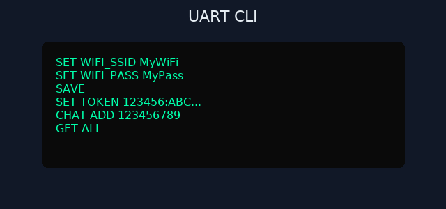
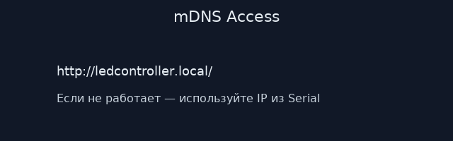

# Учебник по ESP32 LED Controller




Этот репозиторий — проект для управления адресной лентой **WS2812B** на базе **ESP32**.

## Возможности
- Веб-UI с **цветовым колесом (HSV)**, яркостью и ON/OFF.
- **HTTP API** для интеграций.
- **Telegram-бот**: отдельная задача (не тормозит UI), **inline-меню** и **inline-палитра**, **setMyCommands**.
- **UART CLI**: SET/GET/DEL/CHAT/SAVE/REBOOT.
- **NVS**: все параметры сохраняются.
- **mDNS**: доступ по `http://ledcontroller.local/`.

## Аппаратная часть


- GPIO 5 — линия данных WS2812B (по умолчанию).
- Общий GND между лентой и ESP32.
- Рекомендуется резистор 220–470 Ω в данных и конденсатор 1000 µF по питанию.

## Установка ПО
- Arduino IDE + ESP32 core 2.x
- Библиотеки: FastLED, UniversalTelegramBot (ArduinoJson v6), WiFi/WebServer/ESPmDNS/Preferences/WiFiClientSecure/HTTPClient

## Веб-интерфейс


- Кнопка ON/OFF
- Колесо цвета (HSV) — перемещение меняет цвет онлайн
- Яркость (0–255)

## HTTP API


| Метод | URL | Описание |
|---|---|---|
| GET | `/` | Веб-страница |
| GET | `/on` / `/off` | Вкл/Выкл |
| GET | `/api/toggle` | Переключить состояние |
| GET | `/api/state` | JSON-состояние |
| GET | `/api/color?hex=RRGGBB` | Цвет HEX |
| GET | `/api/color?r=..&g=..&b=..` | Цвет RGB |
| GET | `/api/brightness?value=0..255` | Яркость |
| GET | `/set?on=1&color=RRGGBB&brightness=160` | Комбо |

## Telegram-бот
 

**Команды:** `/menu`, `/palette`, `/on`, `/off`, `/bright 0..255`, `/color R G B | #RRGGBB`, `/state`, `/setup_menu`

- `setMyCommands` настраивает системное меню Telegram.
- Inline-меню: Вкл/Выкл/Яркость±/Палитра/Статус.
- Inline-палитра: 2 страницы по 8 цветов.

## UART CLI


Шпаргалка:
```
GET ALL
SET WIFI_SSID MyWiFi
SET WIFI_PASS MyPass
SET HOSTNAME ledcontroller
SET LED_COUNT 60
SET BRIGHTNESS 128
SET POWER 1
SET TOKEN 123456:ABC...
CHAT ADD 123456789
CHAT DEL 123456789
CHAT LIST
DEL KEY WIFI_PASS
SAVE
REBOOT
```

## mDNS


Если `ledcontroller.local` не открывается — используй IP из Serial-лога.

## Безопасность
- Веб по умолчанию открыт.
- Telegram публичный, если не задан `CHAT_IDS` (через `CHAT ADD`).
